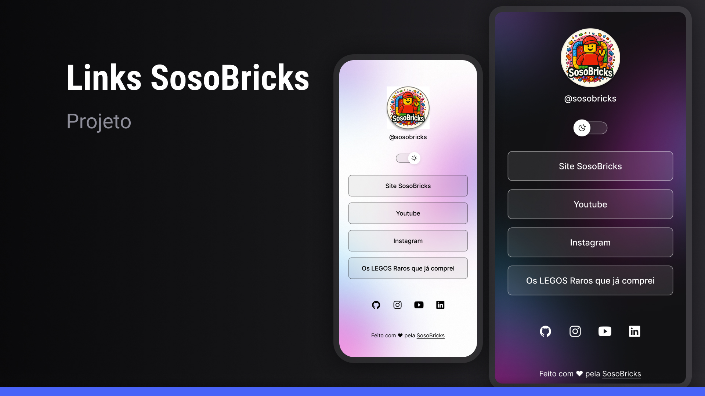

<h1 align="center"> Links-SosoBricks </h1>

Projeto desenvolvido pela SosoBricks, com base no material disponibilizado pelo site da Rocketseat, para compartilhar links e conteúdos da marca de forma prática e visual.  

  <a href="#-tecnologias">Tecnologias</a>&nbsp;&nbsp;&nbsp;|&nbsp;&nbsp;&nbsp;
  <a href="#-projeto">Projeto</a>&nbsp;&nbsp;&nbsp;|&nbsp;&nbsp;&nbsp;
  <a href="#-layout">Layout</a>&nbsp;&nbsp;&nbsp;|&nbsp;&nbsp;&nbsp;
  <a href="#memo-licença">Licença</a>

  <!-- Primeira linha -->
  

    
    
    
  

  <!-- Segunda linha -->
  

    
    
  

 

  

## 🚀 Tecnologias

Esse projeto foi desenvolvido com as seguintes tecnologias:

- HTML e CSS
- JavaScript
- Git e Github
- Figma

## 💻 Projeto

O **Links-SosoBricks** é um agregador de links da marca SosoBricks, funcionando como um cartão de visitas online e espaço para compartilhar conteúdos.

O projeto foi inspirado em um material didático disponibilizado pela Rocketseat, mas desenvolvido e personalizado pela própria SosoBricks.

- [Acesse o projeto finalizado, online](https://lucianocoelho-28.github.io/links-sosobricks/)

## 🔖 Layout

Você pode visualizar o layout do projeto através [DESSE LINK](https://www.figma.com/community/file/1187422022288947321). É necessário ter conta no [Figma](https://figma.com) para acessá-lo.

## :memo: Licença

Esse projeto está sob a licença MIT.

---

Feito com ♥ pela SosoBricks :wave: [Participe da nossa comunidade!](#)
